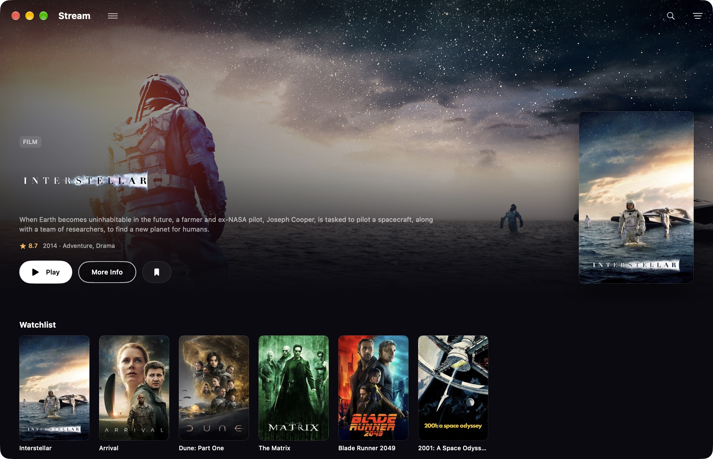
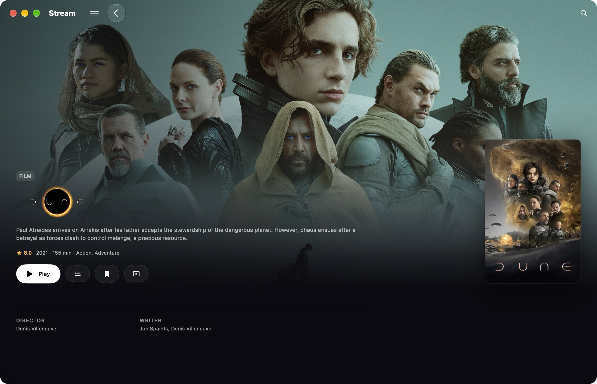

# Stream for Mac

Stream is a free, open-source Mac app for browsing Stremio-compatible addons and playing their video sources. Download the Mac beta below, or [build it yourself](BUILDING.md) from this repository.

**[Download Stream for Mac](https://streammac.itch.io/stream)** · [Report a bug](https://github.com/chrishansen1984x-lang/stream/issues/new/choose) · [Known issues](KNOWN-ISSUES.md)

Requires **macOS 15 or newer**. The download includes Apple silicon and Intel versions. This beta is **unsigned and unnotarized**.

## Download and install

1. Open the [itch.io download page](https://streammac.itch.io/stream) and click **Download Now**.
2. Choose **No thanks, just take me to the downloads** to download for free, or leave an optional tip.
3. Download **Stream for Mac — unsigned beta (Apple silicon + Intel)**, about 45 MB. This is the only file you need to use the app.
4. Unzip `Stream-Mac-Candidate.zip`, then move `Stream.app` to Applications and open it.
5. If macOS blocks it because the developer cannot be verified, and you trust this download, follow [Apple’s instructions](https://support.apple.com/en-gb/102445) to open it through System Settings → Privacy & Security → Open Anyway.
6. Open Stream’s Settings and add your compatible addon manifest URL.

The library source, relinking, and checksum downloads are companion files for developers or people checking the release. They aren’t needed to run Stream.

## What it does

Browse catalogs, search your addons, save titles to a watchlist, and resume playback. Choose a source yourself or let Stream select one. Audio and subtitle selection are available where supported.

Right-click a Continue watching card to mark a movie or episode watched. Right-click a Watchlist title to remove it.

Stream includes no movies, TV streams, or debrid subscription. You need your own compatible addon configuration. It’s an independent app and isn’t affiliated with Stremio.

## Screenshots

These screenshots use a curated demo library.

## Feedback

This is an early beta. Some sources and codecs still have rough edges. Testing has focused on Apple silicon; the Intel build has not been tested on an Intel Mac.

[Open an issue](https://github.com/chrishansen1984x-lang/stream/issues/new/choose) with your Mac model, macOS and app versions, what you did, and what happened. Feedback on installation, playback, audio selection, and resume is especially useful.

Remove tokens, private addon URLs, account information, and signed media links from screenshots and logs before sharing them. Addon URLs can contain credentials, and logs may contain viewing identifiers or source details.

## Support development

If you’d like to help, optional tips on [itch.io](https://streammac.itch.io/stream) go toward Apple Developer membership and continued development. Everyone gets the same features.

I also have iOS and tvOS versions ready to submit once the membership is funded. Apple’s approval isn’t guaranteed, and there’s no promised release date. A tip doesn’t guarantee an iOS or Apple TV release.

## Source and third-party libraries

Stream’s application source is available under the [MIT license](LICENSE). See [BUILDING.md](BUILDING.md) for local builds and [THIRD-PARTY.md](THIRD-PARTY.md) before distributing binaries.

Third-party libraries retain their own licenses. License notices are included in the app. The matching library sources, patches, build information, and relinking materials are available alongside the app on [itch.io](https://streammac.itch.io/stream):

- `Stream-Library-Sources.zip`
- `Stream-Relinking.zip`
- `SHA256SUMS.txt`
