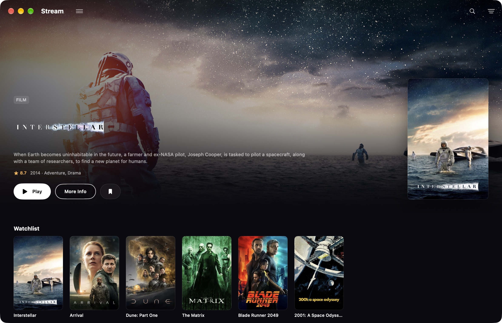
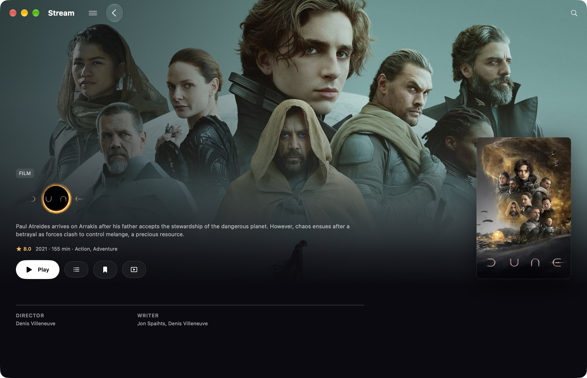

# Stream for Mac

Stream is a free, open-source Mac app for browsing Stremio-compatible addons and playing their video sources. Download the current Mac beta from [GitHub Releases](https://github.com/chrishansen1984x-lang/stream/releases), get the existing download on [itch.io](https://streammac.itch.io/stream), or [build it yourself](BUILDING.md).

**[Download the current Mac beta](https://github.com/chrishansen1984x-lang/stream/releases)** · [itch.io download and optional tips](https://streammac.itch.io/stream) · [Report a bug](https://github.com/chrishansen1984x-lang/stream/issues/new/choose) · [Known issues](KNOWN-ISSUES.md)

Requires **macOS 15 or newer**. The download includes Apple silicon and Intel versions. This beta is **ad-hoc signed and unnotarized**.

## Download and install

1. Download the latest `Stream-Mac-*.zip` from [GitHub Releases](https://github.com/chrishansen1984x-lang/stream/releases). You can still get the existing beta from [itch.io](https://streammac.itch.io/stream) for free or leave an optional tip.
2. Unzip it, move `Stream.app` to Applications, and open it.
3. If macOS blocks it because the developer cannot be verified, and you trust this download, follow [Apple’s instructions](https://support.apple.com/en-gb/102445) to open it through System Settings → Privacy & Security → Open Anyway.
4. Open Stream’s Settings and add your compatible addon manifest URL.

The library source, relinking, and checksum downloads alongside the app are for people rebuilding or checking the release. They aren’t needed to run Stream.

## What it does

Browse catalogs, explore movie genres and subgenres, search your addons, save titles to a watchlist, and resume playback. Title pages include cast, director, and writer links; each person's page has a filmography you can filter by role and genre. Choose a source yourself or let Stream select one. Audio and subtitle selection are available where supported.

Right-click a Continue watching card to mark a movie or episode watched. Right-click a Watchlist title to remove it.

Stream includes no movies, TV streams, or debrid subscription. You need your own compatible addon configuration. It’s an independent app and isn’t affiliated with Stremio.

## Screenshots

These screenshots use a curated demo library.

## Feedback

This is an early beta. Some sources and codecs still have rough edges. Testing has focused on Apple silicon; the Intel build has not been tested on an Intel Mac.

[Open an issue](https://github.com/chrishansen1984x-lang/stream/issues/new/choose) with your Mac model, macOS and app versions, what you did, and what happened. Feedback on installation, playback, audio selection, and resume is especially useful.

Remove tokens, private addon URLs, account information, and signed media links from screenshots and logs before sharing them. Addon URLs can contain credentials, and logs may contain viewing identifiers or source details.

## Support development

If you’d like to help, optional tips on [itch.io](https://streammac.itch.io/stream) support continued development. Everyone gets the same features.

The source also builds for iOS and tvOS. Those versions are not included in the Mac download, and there is no promised App Store release date. Apple’s approval is not guaranteed.

## Source and third-party libraries

Stream’s application source is available under the [MIT license](LICENSE). See [BUILDING.md](BUILDING.md) for local builds and [THIRD-PARTY.md](THIRD-PARTY.md) before distributing binaries.

Third-party libraries retain their own licenses. License notices are included in the app. The matching library sources, patches, build information, and relinking materials are available alongside each app download. For the current build, use its [GitHub release](https://github.com/chrishansen1984x-lang/stream/releases):

- `Stream-Library-Sources.zip`
- `Stream-Relinking.zip`
- `SHA256SUMS.txt`
